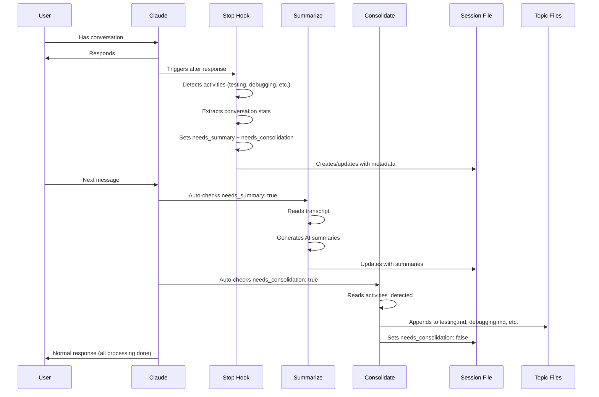

# Session Memory Plugin for Claude Code

Automatic session memory tracking with YAML frontmatter and searchable history.

## Features

- 📝 **Automatic session tracking** - Stop and SessionEnd hooks capture session details
- 🤖 **AI auto-summarization** - Claude automatically summarizes sessions after each conversation
- 📚 **Smart consolidation** - Extracts learnings to topic files (testing.md, debugging.md, etc.)
- 🏷️ **YAML frontmatter** - Structured metadata for easy searching
- 🔍 **Activity detection** - Automatically identifies testing, debugging, learning, architecture, refactoring
- 📊 **Session statistics** - Tracks conversation turns, tool usage, errors
- 🧠 **Memory integration** - Works with Claude Code's auto memory system (200-line MEMORY.md)
- 🔗 **Context preservation** - PreCompact hook prevents context loss during compaction

## Installation

### Quick Install

```bash
# Clone the repository
git clone https://github.com/yourusername/claude-session-memory.git

# Run the installation script
cd claude-session-memory
./install.sh
```

The install script will:
1. Create a symlink in `~/.claude/plugins/session-memory`
2. Make hook scripts executable

### Manual Install

```bash
# Clone the repository
git clone https://github.com/yourusername/claude-session-memory.git

# Create symlink
ln -s "$(pwd)/claude-session-memory" ~/.claude/plugins/session-memory

# Make scripts executable
chmod +x claude-session-memory/hooks/*.sh
```

### Verify Installation

After installation, restart Claude Code and verify the plugin is loaded:

```bash
claude
```

Then check for the skills:
```
/session-memory:session-search
/session-memory:summarize
/session-memory:consolidate
/session-memory:memory-consolidate
```

## How It Works

### Complete Auto-Workflow

The plugin operates completely automatically after installation:



**Step 1: Stop Hook (Automatic)**
- Runs after every Claude response
- Creates session file with YAML frontmatter
- Detects activities: testing, debugging, learning, architecture, refactoring
- Extracts stats: conversation turns, tool calls, errors
- Sets flags: `needs_summary: true`, `needs_consolidation: true`

**Step 2: Auto-Summarization (Automatic)**
- Claude checks for `needs_summary: true` on next response
- Automatically invokes `/session-memory:summarize`
- Reads conversation transcript
- Generates AI summaries: Summary, Work Done, Decisions Made, Next Steps
- Updates session file, sets `needs_summary: false`

**Step 3: Auto-Consolidation (Automatic)**
- Claude checks for `needs_consolidation: true` after summarization
- Automatically invokes `/session-memory:consolidate`
- Reads `activities_detected` from session
- For each activity, extracts and appends to topic files:
  - **testing.md** - Test runs, results, lessons
  - **debugging.md** - Errors, solutions, prevention
  - **learnings.md** - Research, discoveries, insights
  - **architecture.md** - New components, design decisions
  - **patterns.md** - Code patterns, refactoring approaches
- Sets `needs_consolidation: false`

**Result:** Every session is automatically documented, summarized, and consolidated into a searchable knowledge base with zero manual effort.

## Hook System

### Stop Hook
- Runs when Claude finishes responding
- Creates session file with YAML frontmatter containing metadata
- Extracts conversation stats from transcript (turns, tool calls, errors)
- Sets `needs_summary: true` to trigger auto-summarization
- Updates MEMORY.md index (auto-loaded in next session)
- Handles multiple Stop invocations gracefully

### PreCompact Hook
- Runs before context compaction (prevents context rot)
- Captures last 5 conversation turns for context preservation
- Extracts files in focus from recent tool calls
- Appends detailed compaction event note to session file

### SessionEnd Hook
- Runs when session terminates
- Finalizes session metadata (end time, duration, reason)
- Updates session status to "completed"

### Session Files
Located at: `~/.claude/projects/<project>/memory/sessions/<session-id>.md`

Each file contains:
- **YAML frontmatter** with structured metadata
- Summary of work done
- Files modified
- Decisions made
- Next steps

### MEMORY.md
Auto-loaded (first 200 lines) in every session, contains:
- Last 10 session links (1 line each)
- Key patterns extracted from sessions
- Links to topic files for detailed information

## Session Metadata

Each session file includes YAML frontmatter with:

| Field                  | Description                                    |
|------------------------|------------------------------------------------|
| `timestamp_start`      | When session started (ISO 8601)                |
| `timestamp_end`        | When session ended (ISO 8601)                  |
| `session_id`           | Unique session identifier                      |
| `project`              | Project name                                   |
| `git_branch`           | Active git branch                              |
| `git_commit`           | Current commit hash                            |
| `files_modified_count` | Number of files changed                        |
| `permission_mode`      | Permission mode during session                 |
| `status`               | Session status (in_progress, completed)        |
| `tags`                 | Auto-detected tags (testing, documentation...) |
| `transcript`           | Path to full session transcript                |
| `conversation_turns`   | Total conversation exchanges                   |
| `tool_calls`           | Number of tool invocations                     |
| `errors_encountered`   | Failed operations count                        |
| `tools_used`           | Comma-separated list of tools                  |
| `activities_detected`  | Activities for consolidation (testing, debugging, etc.) |
| `needs_summary`        | Whether auto-summarization is pending          |
| `needs_consolidation`  | Whether topic file consolidation is pending    |
| `end_reason`           | Why session ended (clear, logout, etc.)        |

## Skills

### `/session-memory:session-search`

Search sessions by:
- Date range
- Git branch
- Project name
- Tags
- Status

**Examples:**
```
/session-memory:session-search find debugging sessions from last week
/session-memory:session-search show sessions on feature/auth branch
/session-memory:session-search what sessions modified the API?
```

### `/session-memory:summarize`

**Auto-generates session summaries** using AI analysis of the conversation transcript.

**Automatic Mode (Default):**
- Runs automatically after each Stop hook (no user action needed)
- Checks for `needs_summary: true` in session YAML frontmatter
- Generates and inserts summaries without prompting

**Manual Mode:**
```
/session-memory:summarize              # Summarize current session
/session-memory:summarize <session-id> # Summarize specific session
```

**What Gets Generated:**
- One-line summary of accomplishments
- Work Done (bullet points of key changes)
- Decisions Made (architectural/implementation choices)
- Next Steps (actionable tasks for next session)
- Notes (additional context)

All summaries are inserted directly into the session file, replacing placeholder comments.

### `/session-memory:consolidate`

**Auto-extracts learnings** from sessions into topic files based on detected activities.

**Automatic Mode (Default):**
- Runs automatically after session summarization
- Checks for `needs_consolidation: true` and `activities_detected` in YAML
- Updates relevant topic files without prompting

**Manual Mode:**
```
/session-memory:consolidate              # Consolidate current session
/session-memory:consolidate <session-id> # Consolidate specific session
```

**Activity Detection:**
- `testing` → Updates **testing.md** (test runs, results, lessons)
- `debugging` → Updates **debugging.md** (errors, solutions, prevention)
- `learning` → Updates **learnings.md** (research, discoveries, insights)
- `architecture` → Updates **architecture.md** (new components, design decisions)
- `refactoring` → Updates **patterns.md** (code patterns, best practices)

**Topic Files Location:** `~/.claude/projects/{project}/memory/*.md`

Each entry includes:
- Timestamp and brief description
- Relevant context and code snippets
- Key takeaways and lessons
- Link back to full session

### `/session-memory:memory-consolidate`

Extract patterns and learnings from recent sessions into topic files.

**Examples:**
```
/session-memory:memory-consolidate review last 2 weeks
/session-memory:memory-consolidate consolidate this month's sessions
```

## Searching Sessions Manually

With YAML frontmatter, you can use standard command-line tools:

```bash
# Find sessions on a specific branch
grep "git_branch: feature/auth" ~/.claude/projects/*/memory/sessions/*.md

# Find interrupted sessions
grep "status: in_progress" ~/.claude/projects/*/memory/sessions/*.md

# Find sessions from February 2024
find ~/.claude/projects/*/memory/sessions/ -name "*2024-02-*"

# Find sessions with many file changes
grep "files_modified_count: [2-9][0-9]" ~/.claude/projects/*/memory/sessions/*.md
```

## File Structure

After installation, your memory directory will look like this:

```
~/.claude/projects/<project>/memory/
├── MEMORY.md                    # Auto-loaded index (≤200 lines)
├── sessions/                    # Full session details
│   ├── <session-id-1>.md
│   ├── <session-id-2>.md
│   └── ...
├── architecture.md              # Architectural decisions
├── learnings.md                 # Accumulated insights
├── patterns.md                  # Development patterns
└── debugging.md                 # Debugging solutions
```

## Development

### Running Tests

The plugin includes a comprehensive test suite using [bats](https://github.com/bats-core/bats-core):

```bash
# Install bats (one-time setup)
brew install bats-core  # macOS
# or
npm install -g bats     # Linux/Windows

# Run all tests
./test.sh

# Or use make
make test
```

### Test Coverage

- **Stop Hook Tests** (`tests/stop_hook.bats`) - Session creation, YAML frontmatter, file tracking
- **SessionEnd Hook Tests** (`tests/session_end_hook.bats`) - Session finalization, metadata updates
- **Memory Management Tests** (`tests/memory_management.bats`) - MEMORY.md limits, indexing
- **Integration Tests** (`tests/integration.bats`) - Full session lifecycle, multi-project scenarios

### Linting

```bash
# Install shellcheck
brew install shellcheck  # macOS

# Lint all shell scripts
make lint
```

### CI/CD

GitHub Actions automatically runs tests on:
- Ubuntu Latest
- macOS Latest

Tests run on every push and pull request.

## Requirements

- Claude Code >=0.1.0
- `jq` for JSON parsing (install with: `brew install jq` on macOS)
- `git` (optional, for git metadata)
- `bats` (for running tests, development only)

## Troubleshooting

**Hooks not running:**
- Verify scripts are executable: `chmod +x hooks/*.sh`
- Check plugin is enabled via symlink: `ls -la ~/.claude/plugins/session-memory`
- Enable verbose mode: `Ctrl+O`
- Run with debug: `claude --debug`

**Session files not created:**
- Check `~/.claude/projects/` directory exists
- Verify hook scripts have correct permissions
- Check that `jq` is installed: `which jq`

**MEMORY.md exceeds 200 lines:**
- This is normal - the plugin automatically trims it
- Detailed information is preserved in session files
- Use `/session-memory:memory-consolidate` to extract patterns to topic files

## Uninstall

```bash
# Remove the symlink
rm ~/.claude/plugins/session-memory

# Optionally, remove the cloned repository
rm -rf /path/to/claude-session-memory
```

Session files in `~/.claude/projects/` will be preserved.

## Contributing

Contributions are welcome! Please:

1. Fork the repository
2. Create a feature branch
3. Make your changes
4. Test thoroughly
5. Submit a pull request

## License

MIT License - see LICENSE file for details

## Support

- Issues: https://github.com/yourusername/claude-session-memory/issues
- Discussions: https://github.com/yourusername/claude-session-memory/discussions
